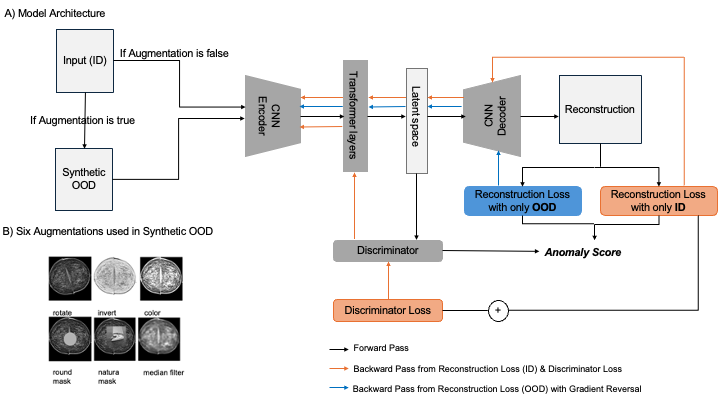

# Unsupervised Hybrid framework for ANomaly Detection (HAND) - applied to Screening Mammogram

## HAND Architecture

Architecture of HAND.

## Create Envirionment 
`conda env create -f hand_env.yml`

## Data Acquisition
- RSNA Screening Mammography Breast Cancer Detection AI Challenge (2023) dataset (https://www.rsna.org/rsnai/ai-image-challenge/screening-mammography-breast-cancer-detection-ai-challenge).

## Data Preprocess (RSNA)
- In ./dataset/ run `python3 ImageExtractor.py` to extract PNG and CSV files from DICOM metadata 

- To concate right and left mammograms, run `python3 Image_concat_save`, this will also save stitched mammograms to the folder you indicate in the file
  

## Training

`python3 train_mammo.py`

## Testing 
If  you want to test the model which has been trained on the RSNA dataset 
- `anomaly_evaluate_aux_GR.ipynb` for quantitative evaluation (AUC score)
- `test_visualiza_aux_GR.ipynb` for qualatative evaluation (reconstruction)

## Citation
If you use our code or models in your work or find it is helpful, please cite the corresponding paper:

- **HAND**:
```

```


## Reference
1. [TransBTS](https://github.com/Rubics-Xuan/TransBTS.git)

